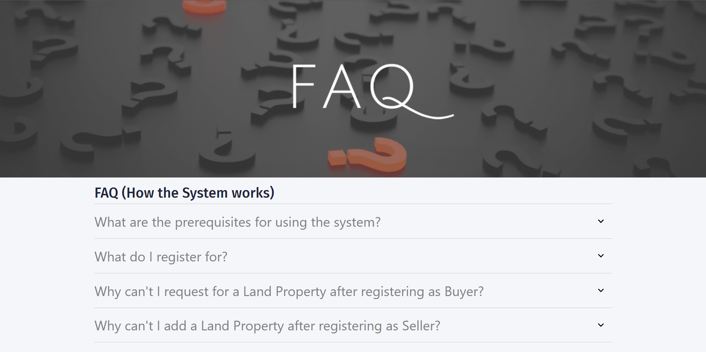
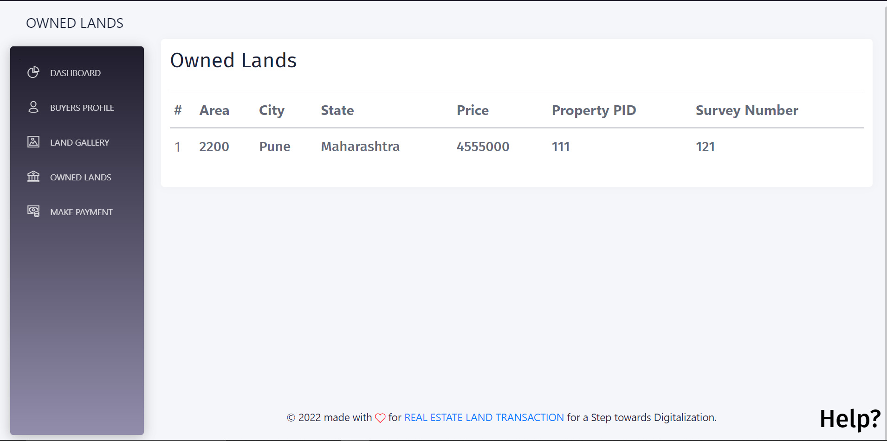

# REAL ESTATE LAND TRANSACTION  

## Team Members:
	
	Dipak Gaikwad
	Gayatri Khedkar
	Shantanu Chavan
	Akshay Hambir

## Project Description:

This is an application of 'REAL ESTATE LAND TRANSACTION'. 
Real Estate Management in India as well as in many parts of the world is a very inefficient and insecure process. 
Developing a secure system that not only accelerates the process of land registration but also makes it efficient and secure will be 
effective. Blockchain technology is one of the latest and secured technologies on the horizon and has evolved over the last 9-11 
years. There is tremendous potential for usage of Blockchain technology in the land industry. This paper presents a blockchain- 
powered real estate management system that will impart transparency, efficiency, and security in Real Estate Management. The 
decentralized data storage application and its interactions with Ethereum Virtual Machine (EVM) are presented to point out the 
event of a sensible contract which will be used for blockchain smart contracts in real estate management. Further, a detailed 
design and interaction mechanism are highlighted for the estate owners and users as parties to a sensible contract. It will store 
all the transactions on a distributed blockchain which will be very secure and will not be prone to hacking. A list of functions for 
initiating, creating, modifying, or terminating a sensible contract is presented and this will help the user enjoy a more immersive, 
user-friendly, and visualized contracting process, whereas the owners and real estate agents can enjoy more business and sales. 
It is a practical solution to the real estate management problem in the real world.  

## Tech Stack Used:

	* Frontend:
		* Javascript
	* React Framework
		* CSS
	* Metamask Chrome Extension

	* Backend:
		* Ethereum Blockchain (Truffle Suite)
    		* Solidity
    		* Ganache

## Application features:  

* **Registration Page**: Seller & Buyer can register for an account on the application. 
* **Land Inspector Dashboard**: Land Inspector works as the admin and is already registered. He can then verify the Sellers, Buyers and approve Land Transfer Process.
* **User Profile**: Seller & Buyer can view their profile via their respective Dashboards.
* **Edit Profile**: Seller & Buyer can edit their profile.
* **Seller Dashboard**: A Brief Description of Added Lands and features to Add a new Land and approve a Land request from a Buyer.
* **Add Land**: Seller can add a land after he/she is verified by the Land Inspector.
* **Approve Land Request**: Approve a Request by Buyer to Buy a Land.
* **Buyer Dashboard**: A Brief Description of all Lands and features to Request a Land to Land Owner of the particular Land. 
* **Owned Lands**: Details of Lands owned by the Buyer after Buying some lands.
* **Make Payment**: Complete Payment transfer to Seller after Land Request is approved.
* **View Lands**: Complete Information of Lands along with its Images and Required Documents.
* **Land Ownership Transfer**: Transfer of Land Ownership from Seller to Buyer via Land Inspector.  

## Steps to run the application:
1. Clone the github repository and cd to the folder 
2. Open _Ganache_ and keep it running in the Background.
3. Make sure you have Metamask Extension in your browser.
4. In the root directory run _truffle migrate --reset_.
5. cd to the _client_ folder and run _npm install_.
6. Run _npm start_.

## Some features of the application:-

Landing Page                   |                   Buyer Registration
:---------------------------------:        |      :------------------------------:
  | 

Buyer Dashboard                   |                   Seller Registration
:---------------------------------:        |      :------------------------------:
     |

Add Land(by Seller)            |                   View all Lands Details
:---------------------------------:        |      :------------------------------:
     |

Help & FAQ Page                |                   Verify Buyer(by Land Inspector)
:---------------------------------:        |      :------------------------------:
     |

Approve Land Request(by Seller)               |             Payment by Buyer 
:---------------------------------:        |      :------------------------------:
     |

Verify Land Transaction(by Land Inspector)    |                   Owned Lands(Buyer)
:---------------------------------:        |      :------------------------------:
     |

View Profile(Before Verification)                 |                   Select Role
:---------------------------------:             |      :------------------------------:
      |

